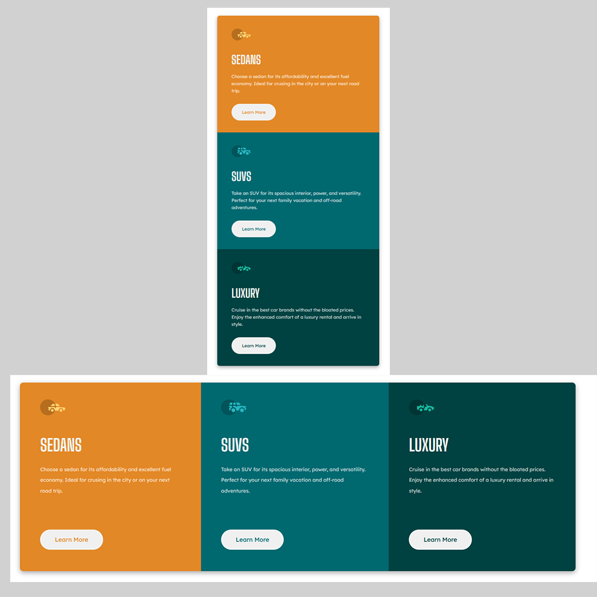

# Frontend Mentor - 3-column preview card component solution Ian Bendiburg

This is a solution to the [3-column preview card component challenge on Frontend Mentor](https://www.frontendmentor.io/challenges/3column-preview-card-component-pH92eAR2-). Frontend Mentor challenges help you improve your coding skills by building realistic projects. The purpose of this project is to practice HTML and CSS skills in building different components.

## Table of contents

- [Overview](#overview)
  - [The challenge](#the-challenge)
  - [Screenshot](#screenshot)
  - [Links](#links)
- [My process](#my-process)
  - [Built with](#built-with)
  - [What I learned](#what-i-learned)
- [Author](#author)

## Overview

### The challenge

Users should be able to:

- View the optimal layout depending on their device's screen size
- See hover states for interactive elements (Buttons)

### Screenshot

### Links

- Solution URL: [Add solution URL here](https://your-solution-url.com)
- Live Site URL: [Add live site URL here](https://your-live-site-url.com)

## My process

### Built with

- Semantic HTML5 markup
- CSS custom properties
- Flexbox
- CSS Grid
- Mobile-first workflow

### What I learned

The main idea behind building this component card is to practice how to build dynamic components that morph depending on the screensize, the component is dynamic, depending on how you rezise the screen the component grows.

## Author

- Ian Bendiburg
- Github  - [Github](https://github.com/ibendiburg)
- CodeWars - [CodeWars](https://www.codewars.com/users/ibendiburg)
- Twitter - [@Burg3rTV](https://twitter.com/Burg3rTV)
